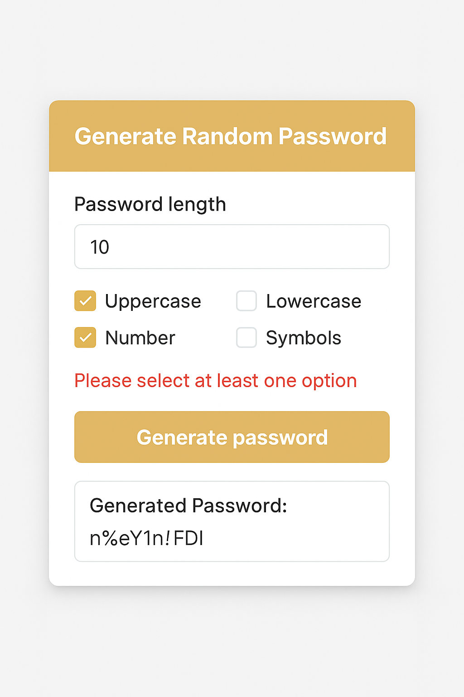

# Random Password Generator

**Year:** 2025  
**Category:** React/Next.js  
**Type:** Utilities  




## Description
Generate secure passwords with customizable options.

## Full Description
The **Random Password Generator** is a React application that lets users generate secure passwords based on selected criteria such as length, uppercase letters, numbers, and symbols. It provides instant password generation with the option to copy results to the clipboard, making it practical for everyday use while demonstrating **state management, conditionals, and clipboard API handling**.

- **Live Demo:** [Random Password Generator](https://random-password-generator-five-eta.vercel.app/)  
- **Repository:** [GitHub Repo](https://github.com/samuel12-dot/random-password-generator.git)

---

## Overview
A password generator built with React that allows customization and instant copy-to-clipboard functionality.

### Features
- Generate passwords with user-selected criteria  
- Supports length, uppercase, lowercase, numbers, and symbols  
- Copy generated password to clipboard with one click  

---

## Getting Started

This is a [Next.js](https://nextjs.org) project bootstrapped with [`create-next-app`](https://github.com/vercel/next.js/tree/canary/packages/create-next-app).

### Development Server
Run the following command to start the dev server:

```bash
npm run dev
# or
yarn dev
# or
pnpm dev
# or
bun dev
